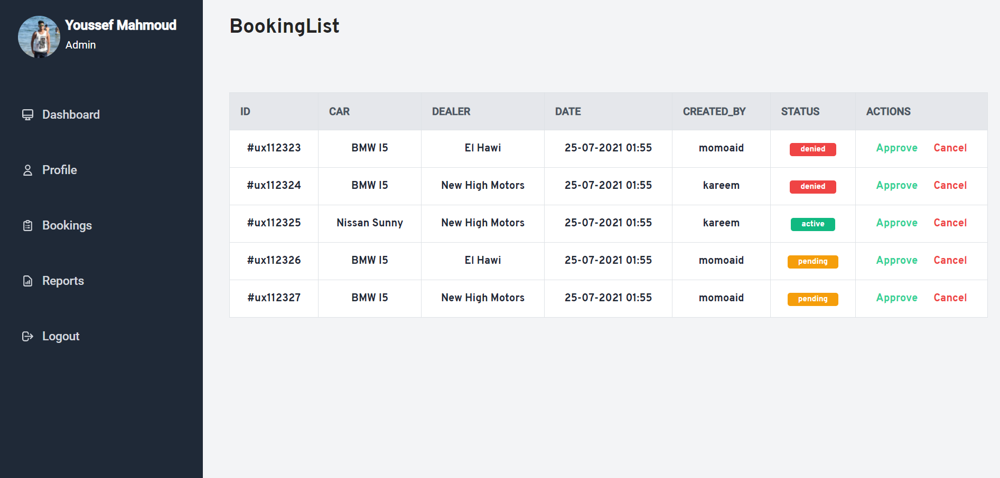

# Wanda-Car Buying System

Wanda is car buying website that facilitates car buying process by givivng ability to choose between different car sellers and book a desired date and time.Wanda Car Buying is built by React framework for frontend ,Django framework for backend,Mongo db for database,and stripe for payment.

<h1>Built With</h1>
<ul>
 <li><a href="https://reactjs.org/">React js</a></li>
 <li><a href="https://www.djangoproject.com/">Django </a></li>
 <li><a href="https://www.mongodb.com/">Mongo DB</a></li>
 <li><a href="https://stripe.com/en-gb-us">Stripe</a></li>
</ul> 

<h1>Screenshots</h1> 
<h2>Auth</h2>
 

<h2>Customer Side</h2> 

<h2> Admin Side</h2>

